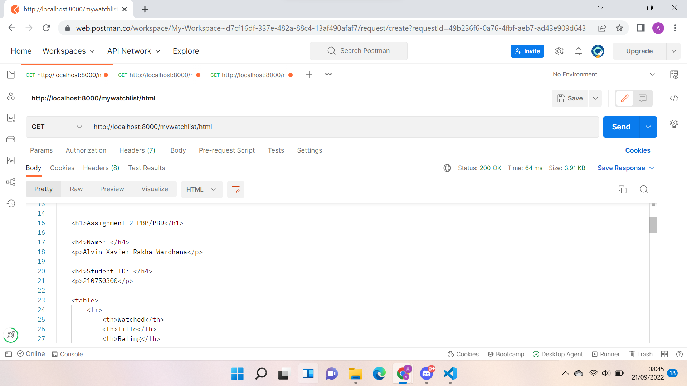
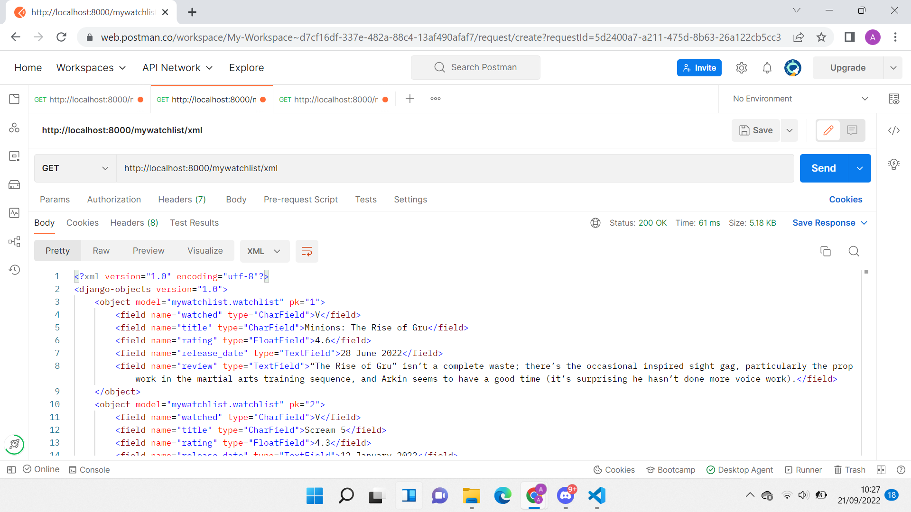
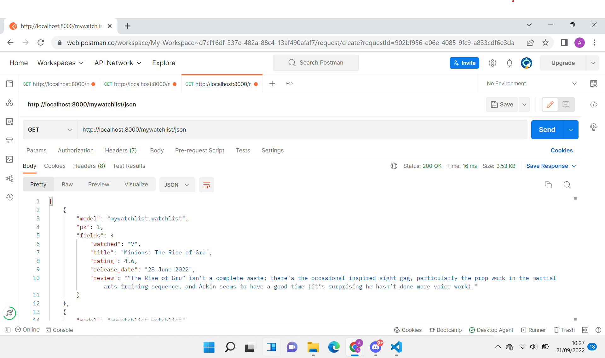

tautan menuju aplikasi Heroku: https://pbp-tugas.herokuapp.com/mywatchlist

**Jelaskan perbedaan antara JSON, XML, dan HTML!**
JSON mampu untuk menyimpan data secara efisien karena menggunakan dictionary sebagai struktur data penyimpanannya, tetapi tampilannya terlihat kurang rapi, sedankan XML menampilkannya dalam bentuk markup language sehingga terlihat lebih rapi, tetapi tidak seefisien JSON. Sementara itu, HTML lebih menitikberatkan data delivery format tampilannya dalam situs.

**Jelaskan mengapa kita memerlukan data delivery dalam pengimplementasian sebuah platform?**
Agar dapat memberikan akses pada pengguna lain untuk melihat data yang ada dalam aplikasi yang telah dibuat oleh developer.

**Jelaskan bagaimana cara kamu mengimplementasikan checklist di atas.**
1. Menginisiasi aplikasi mywatchlist dengan python manage.py startapp mywatchlist
2. Membuat model data-data watchlist pada models.py
3. Menambahkan database JSON yang berisi 10 data-data film
4. Membuat fungsi yang me-render HTML serta men-deliver data-data tersebut dalam bentuk JSON dan XML
5. Menyusun template HTML untuk menampilkan data-data tadi
6. Menambahkan routing baru ke aplikasi mywatchlist, HTML, XML, dan JSON-nya pada urls.py
7. Melakukan migrasi dan load data
8. Menjalankan python manage.py runserver dan membuka localhost:8000 untuk menguji aplikasinya
9. Menambahkan python manage.py loaddata initial_watchlist_data.json pada PROCFILE agar data-datanya dapat muncul ketika di-deploy ke heroku
10. Membuat unit test menggunakan client dan cek responnya apakah mengembalikan HTTP 200 OK
11. Commit ke GitHub

**Akses ketiga URL menggunakan Postman**
1. Akses HTML
Localhost
 
Heroku

2. Akses XML
Localhost
 
Heroku

3. Akses JSON
Localhost
 
Heroku

